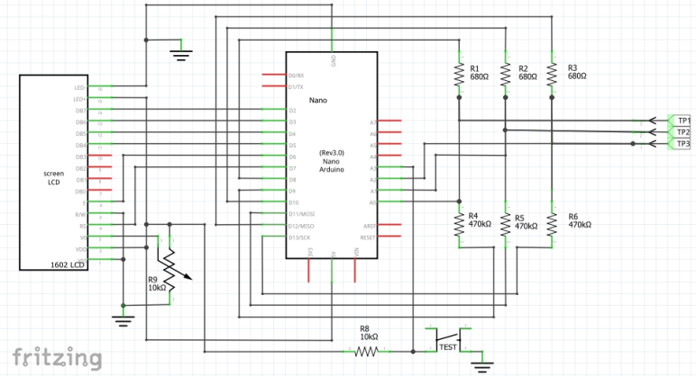

# ArduTester - Geliştirilmiş Sürüm

**Original project:**  
https://github.com/jonsag/arduTester

**Orjinal proje:**  
https://github.com/jonsag/arduTester

---

## ✨ Extra Features / Ekstra Özellikler

- **Uyku modu eklendi:**  
  20 saniye herhangi bir işlem yapılmadığında otomatik olarak uyku moduna geçer ve Arduino'nun tüm işlemleri durur.  
  Butona bastığınızda ArduTester yeniden başlar ve ölçüm yapabilirsiniz.

- **Sleep mode added:**  
  When there is no operation for 20 seconds, ArduTester automatically enters sleep mode and stops all operations.  
  When the button is pressed, it restarts and you can make measurements.

- `Transistörtester.h` dosyasındaki metinler Türkçeye çevrildi (kodda değişiklik yoktur).

---

## 🔌 Devre Şeması / Circuit Diagram

---

## 🖼️ Yeni Özellik Görseli / Sleep Mode Feature Preview

